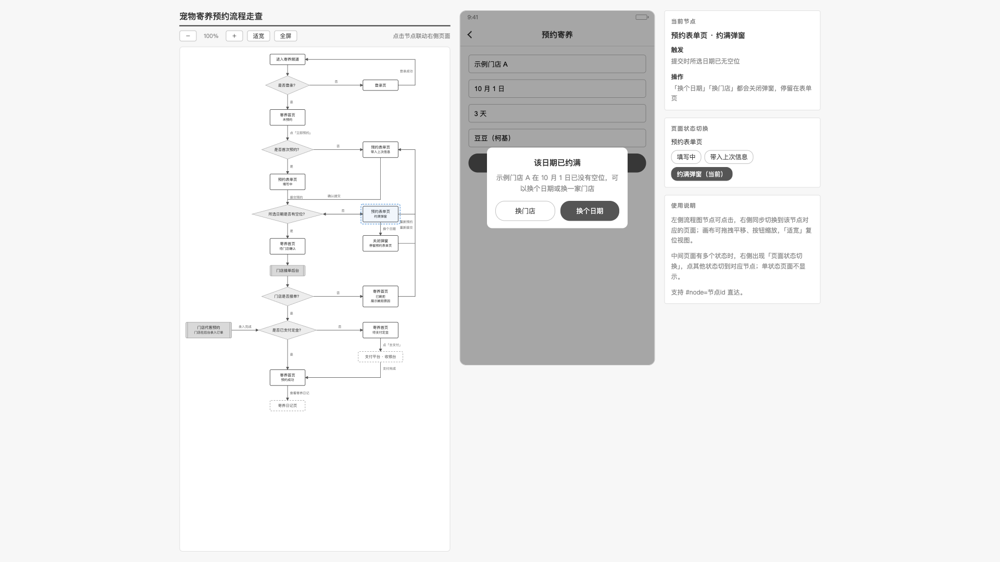
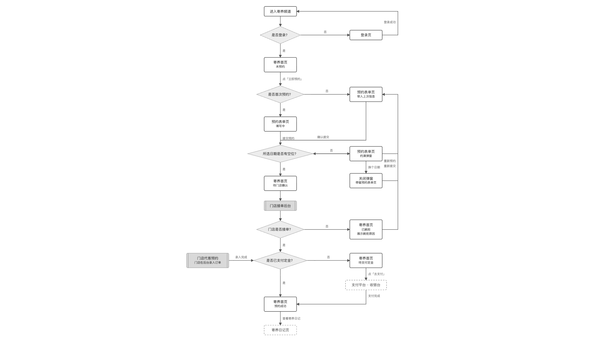
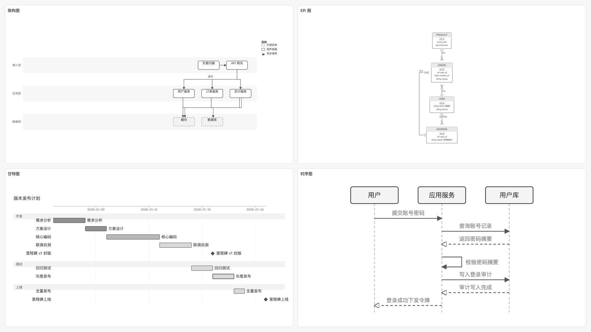

# UEmaster

**需求评审时，点一下流程图，就能看到对应的原型页面。**

UEmaster 是一个给 Claude Code 和 Codex 用的开源技能，里面包含两个小技能：**flow-canvas** 把业务流程按规范画成流程图，**flow-walkthrough** 把流程图和原型页面连成一个能点着走的评审演示页。

*One open-source agent skill with two sub-skills, built for product reviews: click a node in the business flowchart on the left, see its prototype page in the middle, and switch the page's states on the right. Works with Claude Code and Codex.*

https://github.com/user-attachments/assets/905f4869-ca8f-434a-abd7-6f845bb7c024

## 为什么做这个

评审会上，在长长的流程图和一页页原型之间来回切换，手忙脚乱；要是页面还有好几种状态，那更是雪上加霜。

UEmaster 把流程图和原型放进同一个页面：

- ✅ **左边是业务流程图**，每个分支节点都能点
- ✅ **中间联动展示这个节点对应的原型页面**，手机页面和 PC 端页面都支持
- ✅ **右边是这个页面的状态切换按钮**，同一个页面的几种状态，点一下就能切换

我自己在评审会上用了两个月，评审效率大大提高，参会同事的体验也好了很多。



<sub>虚构示例「宠物寄养预约」：点左边的「预约表单页 · 约满弹窗」，中间显示弹窗状态，右边可以切到这个页面的其他状态。</sub>

## 两个小技能

| 小技能 | 做什么 |
| --- | --- |
| **flow-canvas** | 把 PRD 里的业务流程按规范画成流程图，留给 flow-walkthrough 用。架构图、ER 图、甘特图、时序图，它也能画。 |
| **flow-walkthrough** | 把流程图和原型页面连起来，生成三栏评审演示页：左边流程图，中间对应页面，右边状态切换。 |

| flow-canvas 画的业务流程图 | 它也能画架构图、ER 图、甘特图、时序图 |
| --- | --- |
|  |  |

## 用之前：PRD 要先准备好

UEmaster 不负责写 PRD。PRD 需要在上游准备好：你自己写的、团队现有的需求文档，或者用别的工具生成的，都可以。PRD 写得越清楚，画出来的流程图和页面就越准。建议 PRD 里写清楚这几件事：

1. **业务流程和判断分支**：从哪一步开始，每一步做什么；每个判断的条件是什么，成功、失败、取消分别走到哪一步。
2. **每一步对应哪个页面**：也写明哪些步骤是后台处理或外部系统（比如支付、发短信），这些步骤没有用户能看到的页面。
3. **每个页面有哪几种状态**：每种状态在什么情况下出现，比如约满时弹出提示、没有数据时显示空页面、提交成功后出现提示条。
4. **页面上要有的内容**：主要按钮、输入项和关键文案。技能只画 PRD 里写到的内容，不会自己编。

已经有原型页面（HTML 文件）的话，和 PRD 一起交给它，效果最好；没有原型时，它会按 PRD 画出灰色的线框页面。

## 怎么用

装好之后，在 Claude Code 或 Codex 里直接说：

- 「把这份 PRD 的业务流程画成流程图」：用的是 flow-canvas
- 「把这张流程图和这几个原型页面做成评审用的联动演示」：用的是 flow-walkthrough

flow-walkthrough 生成演示页之前，会先列一张「流程节点—原型页面」对应表请你确认。最后得到一个网页文件，发给同事双击就能打开，不用联网，也不用装任何软件。

**适合**：需求评审、交互走查、给开发和测试讲流程。**不适合**：高保真视觉稿，或者要接真实数据的可交互原型。

## 安装

两个小技能要一起装（flow-walkthrough 要用 flow-canvas 画的流程图），电脑上需要有 Python 3.8 或更高版本。装好后新开一个会话就能用。

### 最省事：让 AI 帮你装

把下面这段话发给 Claude Code 或 Codex：

> 请把 https://github.com/roxorlt/UEmaster 下载到本地，然后把里面 skills 目录下的 flow-canvas 和 flow-walkthrough 两个文件夹链接到我的技能目录（Claude Code 是 ~/.claude/skills/，Codex 是 ~/.codex/skills/），装好后分别运行两个技能的 scripts/selftest.py 自检。

### 自己动手装

先把仓库下载到本地：

```bash
git clone https://github.com/roxorlt/UEmaster.git
cd UEmaster
```

**Claude Code**：技能目录是 `~/.claude/skills/`

```bash
mkdir -p ~/.claude/skills
ln -s "$(pwd)/skills/flow-canvas" ~/.claude/skills/flow-canvas
ln -s "$(pwd)/skills/flow-walkthrough" ~/.claude/skills/flow-walkthrough
```

**Codex**：技能目录是 `~/.codex/skills/`

```bash
mkdir -p ~/.codex/skills
ln -s "$(pwd)/skills/flow-canvas" ~/.codex/skills/flow-canvas
ln -s "$(pwd)/skills/flow-walkthrough" ~/.codex/skills/flow-walkthrough
```

两个工具都用的话，两段都运行。用链接的方式安装，以后在仓库目录里运行 `git pull`，技能就会更新到最新版。

<details>
<summary>Windows 用 PowerShell 安装</summary>

Windows 默认不能用 `ln -s`，改用目录联接（不需要管理员权限）。下面是 Claude Code 的命令，Codex 把 `.claude` 换成 `.codex`：

```powershell
New-Item -ItemType Directory -Force "$HOME\.claude\skills" | Out-Null
New-Item -ItemType Junction -Path "$HOME\.claude\skills\flow-canvas" -Target "$PWD\skills\flow-canvas"
New-Item -ItemType Junction -Path "$HOME\.claude\skills\flow-walkthrough" -Target "$PWD\skills\flow-walkthrough"
```

Windows 上的 Python 命令通常是 `python` 或 `py -3`，不是 `python3`。

</details>

### 检查有没有装好

在仓库目录里运行：

```bash
python3 skills/flow-canvas/scripts/selftest.py
python3 skills/flow-walkthrough/scripts/selftest.py
```

两条都显示「自检全部通过」就装好了。也可以新开一个会话，说「用 flow-canvas 画一个三步的示例流程图」试一下。

## 放心用

- 只用 Python 自带的功能，不装第三方库
- 任何时候都不联网，没有使用统计
- 只往你指定的位置写文件
- flow-walkthrough 会把页面文件原样放进演示页，不做过滤（页面里可以带脚本），请只用可信的页面文件

## 更多说明

- [flow-canvas 详细说明](skills/flow-canvas/README.md)：支持哪些图、输入怎么写、排版检查
- [flow-walkthrough 详细说明](skills/flow-walkthrough/README.md)：输入格式、页面状态切换、画页面的规则

个人项目，有空时维护，欢迎提 issue。

## License

MIT
